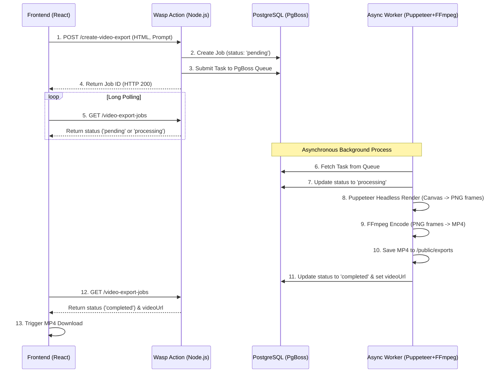

# PR: feat(ai-video): implement HTML animation to MP4 export pipeline

## 核心链路说明
本次 PR 实现了“题目 6：HTML 动画转视频”的核心需求。
整体架构链路为：**前端提交 (Prompt + HTML) -> Wasp Action -> PgBoss 异步队列 -> Puppeteer 无头沙盒渲染 -> FFmpeg 帧压制 -> Express 静态代理 -> 前端轮询下载**。

---

## 整体方案设计 (Architecture Design)

在全栈（Wasp + Node.js）架构下，视频渲染属于典型的**重度 CPU/IO 密集型任务**，绝对不能阻塞 HTTP 请求。本方案以**“分布式队列 + 无头浏览器渲染 + 视频流编码 + 状态机流转”**为底层机制，构建了高并发下的异步处理流水线。

核心执行路径如下：

1. **异步化与分布式队列 (Distributed Queue)**：
   * 在 `main.wasp` 中定义基于 `PgBoss` (PostgreSQL 支持的队列) 的 Background Job。
   * HTTP Action 在接收到生成的 HTML 后，创建任务并立即投递到队列，绝不阻塞主线程。

### 架构时序图 (Sequence Diagram)



2. **状态机与容错机制 (State Machine & Fault Tolerance)**：
   * **状态流转**：定义了严密的任务状态流转路径：`Pending` (排队中) -> `Processing` (渲染压制中) -> `Completed` (成功) / `Failed` (失败)。
   * **容错设计**：依托 PgBoss，系统具备了处理超时（Timeout）与失败重试（Retry）的能力；连续失败的异常任务将进入死信队列（Dead Letter Queue）以便后续补偿与排查。
3. **无头浏览器渲染 (Headless Render)**：
   * Worker 从队列提取任务后，启动无头浏览器（Puppeteer）并在安全沙盒内加载用户生成的 HTML 动画。
   * 采用高频按帧截图（`page.screenshot`）的方式，精准捕获 DOM/Canvas 动画序列。
4. **视频流编码与交付 (FFmpeg Encode & Delivery)**：
   * 调用本地 FFmpeg 进程，使用 `libx264` 编码器将捕获的离散帧序列压制为 MP4/WebM 视频。
   * 将成品上传至静态资源目录以**模拟 S3/OSS 的云端存储**，获取最终的 Download URL，并通过前端轮询完成交付闭环。

---

## 1. 设计取舍 (Trade-offs)

在 2 天的 Timebox 约束下，为保证核心逻辑的高内聚与可验证性，系统在架构与实现上做出了如下取舍：

*   **计算下沉 vs. 架构复杂度（放弃 S3/OSS）**：
    *   **为什么这么做**：当前视频合成后的文件直接落地在 `public/exports` 目录，并通过 Wasp (Express) 的 `setupFn` 注入静态资源路由来提供下载。
    *   **放弃了什么**：放弃了引入 AWS SDK 或 MinIO 进行云端对象存储的方案。在单体部署（或测试环境）下，直接写本地磁盘能最快闭环体验；但这在 K8s/Serverless 容器化部署中会导致状态丢失（Stateful）。
*   **硬编码录制策略 vs. 动态流控制**：
    *   **为什么这么做**：当前在 `workers.ts` 中硬编码了录制时长（3 秒）和帧率（30fps），通过定长的 `for` 循环和简单的 `setTimeout` 进行截图。
    *   **放弃了什么**：放弃了在沙盒 HTML 中注入通信钩子（如监听 CSS `animationend` 事件或通过 `window.onMessage` 通信）的精准录制方案，牺牲了部分边缘场景（如无限循环动画或超长动画）的适配性，换取了后台 Worker 的极简实现与稳定性。
*   **资源清理策略的妥协**：
    *   **为什么这么做**：在 `finally` 块中，主动保留了存放原始 HTML 和中间帧（`.png`）的临时目录（`/tmp/video-export-xxx/`）。
    *   **放弃了什么**：放弃了执行 `fs.rmSync` 的强制清理。这是为了便于在开发和 Review 阶段进行 Debug；但在生产环境的高并发下，这会导致严重的磁盘“熵增”和 IO 耗尽。

## 2. 测试方式 (Testing & Validation)

验证系统的正确性与边界，主要通过以下几个维度：

*   **核心链路验证 (Happy Path)**：
    *   注入带关键帧动画的 CSS（如 `transform: translateY`）。
    *   观察前端轮询：状态由 `pending` -> `processing` -> `completed`。
    *   验证产物：点击下载后，确认生成的 `.mp4` 视频时长正确（3秒）、画面无破损，且动画流畅。
*   **跨域与资源隔离验证**：
    *   前端运行在 `:3000`，后端运行在 `:3001`。测试时特别验证了通过注入 Express 静态中间件，确保前端能跨端口成功拉取到物理生成的 MP4 文件，而不触发 404 兜底路由。
*   **边界与容错处理 (Edge Cases)**：
    *   **空参数攻击**：利用 Zod Schema 在 API 层拦截空 `prompt` 或 `htmlContent`，抛出 400 Bad Request，并在前端 UI 前置拦截。
    *   **渲染引擎崩溃**：在本地测试过缺少 `libnspr4.so` 等底层动态库导致 Puppeteer 启动失败的场景，验证了 `catch` 块能正确捕获进程退出信号，并将数据库状态置为 `failed`，避免出现僵尸任务。
    *   **空文件防御**：压制完成后加入 `fs.statSync(outputVideoPath).size === 0` 校验，防止因 FFmpeg 编码异常向前端返回无效（0KB）的损坏视频。

## 3. 后续规划 (Future Work)

如果在真实的生产环境中，本功能还需向以下方向演进：

1.  **沙盒安全加固 (Security)**：
    目前直接将用户输入的 HTML 写盘并在 Puppeteer 中执行，存在严重的 XSS 与本地文件读取风险。后续需对 HTML 进行严格的 AST 净化（如使用 `DOMPurify`），并对 Puppeteer 开启更严格的沙盒隔离参数。
2.  **流式管道与内存优化 (Memory/IO Optimization)**：
    当前方案是将 90 帧图片全部落盘后再调用 FFmpeg 读取。演进方案应改为**内存管道流 (Pipe)**：通过 Puppeteer 的 `page.screencast` 或直接将截图 Buffer 通过 `stdin` 管道喂给 FFmpeg，实现边录边压，极大降低磁盘 I/O 压力。
3.  **持久化与分布式调度**：
    将视频文件对接 S3/CDN，生成 Presigned URL；同时，将视频压制节点从主 Web 服务中剥离，利用 Serverless 函数（如 AWS Lambda 或专用的 GPU Worker 节点）来承载重 CPU 密集的 FFmpeg 任务。

---

## 4. 本地环境复现指南 (Local Setup Guide)

考虑到视频渲染对底层 OS 依赖较重，为避免跨平台（如 Windows 宿主机）带来的 `EBADPLATFORM` 或 I/O 性能问题，**强烈建议在 Linux (WSL / Ubuntu) 原生环境下运行本项目**。

### 环境准备与依赖安装

1. **基础环境安装 (Node & Wasp)**：
   确保在 Linux/WSL 中已安装 Node.js (v20+)，然后安装 Wasp 编译器：
   ```bash
   npm i -g @wasp.sh/wasp-cli
   ```

2. **安装核心渲染与压制依赖**：
   在 `template/app` 目录下，安装 Puppeteer 与 FFmpeg 绑定库：
   ```bash
   npm install puppeteer fluent-ffmpeg @ffmpeg-installer/ffmpeg
   npm install -D @types/fluent-ffmpeg
   ```

3. **补齐 Linux 缺失的系统库 (.so) 与工具**：
   *(关键步骤：若在纯净的 Ubuntu/WSL 中运行，Puppeteer 会因缺少图形库报错；同时后台打包过程依赖 `zip` 工具)*
   ```bash
   sudo apt-get update && sudo apt-get install -y \
     zip unzip ca-certificates fonts-liberation libappindicator3-1 libasound2 \
     libatk-bridge2.0-0 libatk1.0-0 libc6 libcairo2 libcups2 libdbus-1-3 \
     libexpat1 libfontconfig1 libgbm1 libgcc1 libglib2.0-0 libgtk-3-0 \
     libnspr4 libnss3 libpango-1.0-0 libpangocairo-1.0-0 libstdc++6 \
     libx11-6 libx11-xcb1 libxcb1 libxcomposite1 libxcursor1 libxdamage1 \
     libxext6 libxfixes3 libxi6 libxrandr2 libxrender1 libxss1 libxtst6 \
     lsb-release wget xdg-utils
   ```

4. **强制初始化 Puppeteer 浏览器沙盒**：
   ```bash
   npx puppeteer browsers clear
   npx puppeteer browsers install chrome
   ```

### 启动项目

1. **配置环境变量**：
   ```bash
   cp .env.server.example .env.server
   cp .env.client.example .env.client
   ```
2. **启动数据库并执行 Migration**：
   *(确保已开启 Docker Desktop)*
   ```bash
   wasp start db
   wasp db migrate-dev  # 输入自定义的 migration 名字，如 init
   ```
3. **灌入测试数据（可选，用于快速登录）**：
   ```bash
   wasp db seed
   ```
4. **启动全栈服务**：
   ```bash
   wasp start
   ```
   *(启动成功后，前端运行在 `:3000`，后端 API 运行在 `:3001`)*

5. **查看数据库后台（可选）**：
   如果需要直接查看或修改数据库数据（如查看 VideoExportJob 表的状态），可以新开一个终端运行 Prisma Studio：
   ```bash
   wasp db studio
   ```
   *(会自动在浏览器打开 `:5555` 端口的数据库可视化管理后台)*

---

### 快速测试用例 (Quick Test Case)

服务启动后，访问 `http://localhost:3000/video-export`，登录测试账号后，可使用以下 HTML 动画样例进行快速测试：

**Prompt**: `一个跳动的红色方块`

**HTML Content**:
```html
<html>
  <style>
    body { background: #f0f0f0; display: flex; justify-content: center; align-items: center; height: 100vh; margin: 0; }
    .box { width: 100px; height: 100px; background: red; animation: bounce 1s infinite alternate; }
    @keyframes bounce { from { transform: translateY(0); } to { transform: translateY(-200px); } }
  </style>
  <body>
    <div class="box"></div>
  </body>
</html>
```

点击 **Export to Video**，等待约 5~8 秒后，任务状态将变更为 `completed`，点击右侧的 **Download Video** 即可下载生成的 `mp4` 视频文件。

---

### 演示视频 (Demo Video)

https://github.com/izhuqiang/open-saas-interview/raw/feat/ai-animation-to-video/template/app/public/demo.mp4
